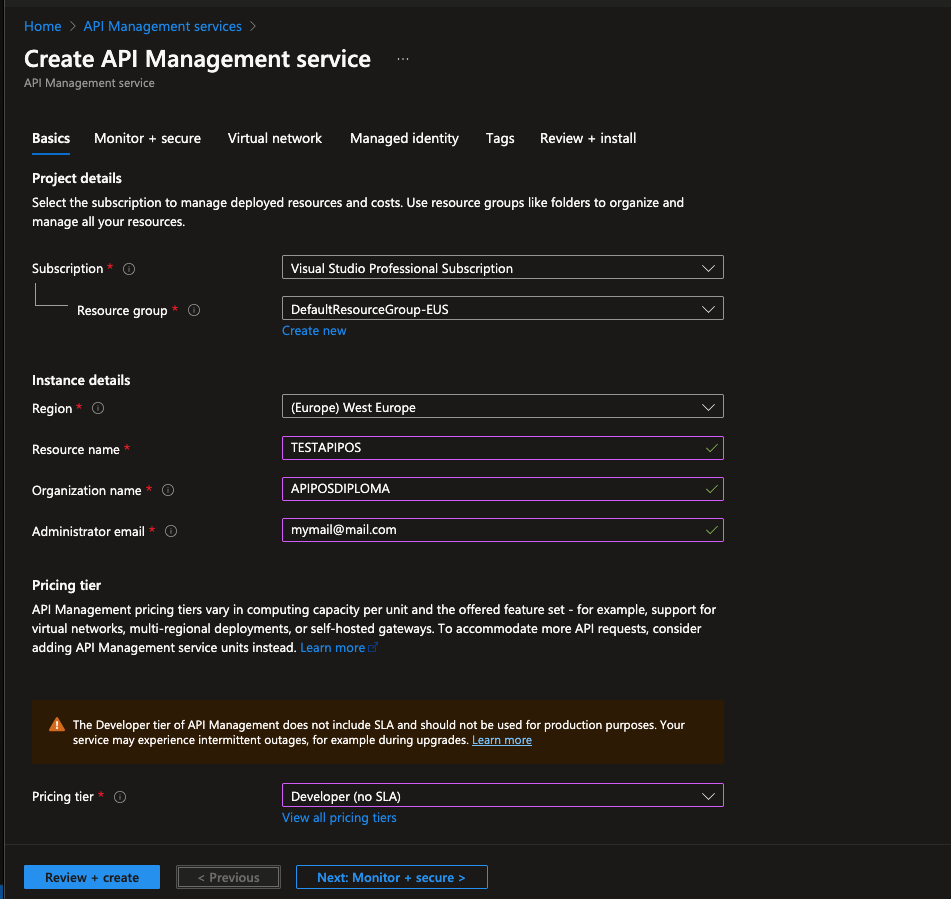

# Systémová príručka

## Celková charakteristika architektúry

Architektúra POS systému je navrhnutá tak, aby umožňovala efektívnu komunikáciu medzi klientmi a backendovými službami. Systém integruje moderné komponenty založené na mikroslužbách s existujúcou staršou monolitickou infraštruktúrou prostredníctvom centralizovanej API Gateway. Systém podporuje cloudové aj lokálne nasadenie, čím poskytuje flexibilitu pre rôzne obchodné potreby.

### Základné komponenty

- **Brána API (Azure API Managment)** 
Funguje ako centrálny bod, ktorý zabezpečuje overovanie, riadenie prístupu a presmerovanie požiadaviek. Podporuje aj skladanie požiadaviek, preklad protokolov a ukladanie do medzipamäte.

- **Azure Relay (komunikačný most)** 
Zabezpečuje bezpečnú komunikáciu v reálnom čase medzi cloudom a lokálnymi POS servermi. Eliminuje potrebu verejných IP adries alebo VPN.

- **POS Backend** 
Simuluje tradičný POS systém zodpovedný za základné maloobchodné funkcie, ako je spracovanie objednáviek alebo pridávanie produktov.

- **Backoffice** 
Pozostáva z modulárnych služieb zodpovedných za správu používateľov a analytické dáta. Služby sú nasadené prostredníctvom Azure App Services a nezávisle škálovateľné.

- **MongoDB** 
Databáza NoSQL založená na dokumentoch, ktorú používajú všetky služby na ukladanie a načítanie údajov.

### Schéma architektúry


Nasledujúci diagram znázorňuje architektúru navrhovanej konceptu POS systému. 


Nasledujúci sekvenčný diagram znázorňuje komunikačný tok medzi klientom, API bránou, autentifikačnou mikroslužbou a backendovou službou a ukazuje, ako sa požiadavka spracuje, overí a presmeruje na príslušnú službu pred odoslaním odpovede klientovi.


### Komponenty

Architektúra systému POS sa skladá z niekoľkých komponentov, ktoré spolupracujú na zaistení efektívnej komunikácie medzi klientmi a backendovými službami. V nasledujúcej časti je uvedený prehľad jednotlivých hlavných komponentov a spôsobu integrácie do celkovej architektúry systému.


#### POS backend

POS Backend predstavuje základnú obchodnú logiku. Je vyvinutý ako monolitická aplikácia využívajúca ASP.NET 8 a poskytuje rozhrania RESTful API na správu údajov o produktoch, spracovanie objednávok, spracovanie platieb a riadenie pokladničných operácií.

Tento komponent je navrhnutý tak, aby sa dal nasadiť v prostredí cloudu aj v lokálnych pobočkách. Používa autorizáciu založenú na rolách pomocou tokenov JWT, aby sa zabezpečilo, že k operáciám budú mať prístup len overení používatelia s príslušnými oprávneniami.

POS Backend obsahuje nasledujúce služby:

Súčasťou POS Backend sú nasledujúce podmoduly:

##### Správa produktov

`ProductController` poskytuje koncové body na zobrazovanie, vytváranie, aktualizáciu a mazanie produktov. Prístup je riadený prostredníctvom používateľských rolí:

- **GET** `/api/product`: Vyhľadá všetky produkty (len pre manažéra)

- **GET** `/api/product/locations`: Vyhľadá produkty podľa lokality (manažér, pokladník).

- **POST** `/api/product/create`: Vytvorí nový produkt (iba Manager)

- **PUT** `/api/product/{id}`: Aktualizuje informácie o produkte

- **DELETE** `/api/product/{id}`: Odstráni produkt

##### Správa platieb

`PaymentsController` spracúvava záznamy o platbách:

- **GET** `/api/payments`: Získava všetky platobné záznamy

- **POST** `/api/payments/pay`: Vytvorí platbu spojenú s objednávkou

- **POST** `/api/payments/refund`: Vráti predtým spracovanú platbu

- **DELETE** `/api/payments/delete`: Odstráni záznam o platbe

##### Správa objednávok

`OrdersController` umožňuje vykonávať operácie nad objednávkami:

- **GET** `/api/orders`: Vráti všetky objednávky (iba manažér)

- **GET** `/api/orders/locations`: Vráti objednávky podľa umiestnenia

- **POST** `/api/orders/create`: Vytvorí novú objednávku

- **PUT** `/api/orders/update`: Aktualizuje existujúcu objednávku

- **DELETE** `/api/orders/delete`: Odstráni objednávku

##### Operácie s pokladňou

`CashRegisterController` riadi pokladničné operácie na pobočke:

- **POST** `/api/cashregister/open`: Otvorí novú pokladňu s počiatočným zostatkom

- **POST** `/api/cashregister/close`: Zatvorí otvorenú pokladňu

- **POST** `/api/cashregister/cashin`: Pridá finančné prostriedky do registra

- **POST** `/api/cashregister/cashout`: Odstráni hotovosť z pokladnice

- **POST** `/api/cashregister/receipt`: Po transakcii vygeneruje účtenku

##### Autentifikácia a autorizácia

Všetky kontroléry používajú atribút `[Authorize]` na obmedzenie prístupu konkrétnym rolám:

- `Manager`

- `CashierBA`, `CashierKE` (na základe rolí pokladníkov podľa miesta)

#### Backoffice

Backoffice aplikácia je vyvinutá s využitím architektúry mikroslužieb, aby sa zabezpečila škálovateľnosť, modularita a jednoduchšia údržba. Backoffice je navrhnutý tak, aby dopĺňal monolitickú pokladničnú aplikáciu tým, že odľahčuje administratívne a analytické funkcie. Backoffice je rozdelený na dve samostatné mikroslužby:

#### Mikroslužba správy používateľov

Táto mikroslužba je zodpovedná za správu účtov zamestnancov, spracovanie autentifikácie a presadzovanie riadenia prístupu na základe rolí v celom pokladničnom systéme.

Koncovové body:


- **Prihlásenia** (`POST /api/user/login`): Overuje používateľov a vracia token JWT pre autorizovaný prístup k backendovým zdrojom.

- **Rola uživateľa** (`GET /api/user/role?token={token}`): Dekóduje token JWT na získanie roly a umiestnenia používateľa. Tento koncový bod používa brána API na presmerovanie.

- **Správa používateľov** (`GET`, `POST`, `PUT`, `DELETE /api/user/users`): Tieto koncové body umožňujú manažérom vytvárať, načítavať, aktualizovať a odstraňovať používateľské účty. Všetky operácie sú chránené pomocou autorizácie založenej na rolách. Tento koncovový bod vie použiť iba zamastnanec, ktorý ma rolu `Manager`.
- **Registrácia** (`POST /api/user/register`): Slúži na pridávanie nových zamestnancov do systému.
  
- **Aktualizácia a mazanie**: Prístupné len používateľom s rolou `Manager`, aby sa zachoval kontrolovaný prístup k údajom používateľov.

Táto mikroslužba úzko spolupracuje s API Gateway, ktorá autentifikuje používateľov a presmeruje požiadavky na základe rolí.

#### Mikroslužba výkazov

Služba výkazov poskytuje prehľad o výkonnosti podniku. Agreguje a vracia analýzy na základe údajov o transakciách zhromaždených backendom POS.

Funkcie:

- **Vykazovanie predaja** (`GET /api/reports/sales`): Generuje prehľady o predaji za zadaný časový interval.

Prístup k tejto mikroslužbe je obmedzený na používateľov s rolou `Manager`, čím sa zabezpečí, že k citlivým finančným analýzam majú prístup len oprávnení pracovníci.

### Nastavenie databázy

POS systém používa MongoDB ako primárnu NoSQL databázu na ukladanie údajov. Všetky komponenty zdieľajú prístup k spoločnej inštancii MongoDB umiestnenej v cloude.

#### Nasadenie 

Databáza musí byť nasadená pomocou [MongoDB Atlas](#https://cloud.mongodb.com/), plne spravovanej cloudovej databázovej služby.

#### Požadované kolekcie

Na zabezpečenie funkčnosti vo všetkých službách musia byť v databáze prítomné nasledujúce kolekcie:

- `orders`
- `products`
- `payments`
- `cashRegister`
- `receipts`

Databáza je nakonfigurovaná pod názvom `POSDatabase`.

#### Konfigurácia v appsettings.json

Každý projekt musí vo svojom súbore `appsettings.json` obsahovať nasledujúcu `MongoDBSettings` časť. Tým sa zabezpečí, aby sa všetky služby pripájali k inštancii MongoDB

Reťazec pre pripojenie k databáze:

```json
"MongoDBSettings": {
    "ConnectionString": "{connectionstring}",
    "DatabaseName": "POSDatabase",
    "OrdersCollectionName": "orders",
    "ProductsCollectionName": "Products",
    "PaymentsCollectionName": "payments",
    "CashRegisterCollectionName": "CashRegister",
    "ReceiptsCollectionName": "Receipts"
}
```

### Lokálne nasadenie

Táto časť opisuje kroky potrebné na lokálne nasadenie a spustenie POS systému na účely vývoja alebo testovania.

#### Podmienky pre systém

Pre lokálne nasadenie systému je potrebné mať na počítači nainštalované nasledujúce nástroje a komponenty:

- NET SDK 8.0.x](https://dotnet.microsoft.com/en-us/download)
- [Visual Studio 2022](https://visualstudio.microsoft.com/)
  - Počas inštalácie treba mať zahrnuté nasledujúce moduly:
    - ASP.NET and web development
    - .NET desktop development

#### Nastavenie projektu

Po nainštalovaní požadovaných komponentov a stiahnutí zdrojového kódu treba postupovať podľa nasledujúcich krokov:

1. Otvorte terminál a prejdite do adresára projektu, kde sa nachádza súbor `.sln`.

2. Závislosti projektu obnovte pomocou nasledujúceho príkazu:

```cmd
    dotnet restore
```

Tento príkaz zabezpečí, aby boli stiahnuté všetky potrebné nugety, na ktoré sa odkazuje.

#### Spustenie aplikacií

Spustenie POS systému
```cmd
cd pos-backend
dotnet run
```
Spustenie backoffice analytickej mikroslužby
```cmd
cd ../pos-backoffice
dotnet run
```

Spustenie backoffice mikroslužby správy používateľov
```cmd
cd ../pos-backoffice-user-management
dotnet run
```

### Nasadenie v cloudovej službe Microsoft Azure

Na nasadenie POS systému v cloude sa používajú služby Microsoft Azure App Services. Táto časť obsahuje návod na nastavenie a nasadenie komponentov aplikácie do služby Microsft Azure.

#### 1. Nastavenie účtu

Pred začatím nasadenia je potrebné:

- máť platné konto [Microsoft Azure](https://azure.microsoft.com/)
- byť prihlásení do [Azure Portal](https://portal.azure.com/)

#### 2. Konfigurácia Azure App Services

Systém sa skladá z troch aplikacií, ktoré je potrebné nasadiť samostatne:

- POS Backend
- Mikroslužba správy používateľov
- Mikroslužba výkazov

##### 2.1 Vytvorenie služby App Service

1. Na portáli Azure prejdite na položku **App Services** a kliknite na **Create** 

2. Nastavte potrebne konfigurácie ako na obrázku


3. Napojte sa na svoj GitHub, kde sa nachádza zdrojový kód (GitHub prepojenie doporučujeme pre jednoduché nasadenie a automatické vytvorenie .yaml súborov)


4. Kliknite na **Review + create**

5. Na GitHube v priečinku `.github\workflows` by sa mal nachadzat .yaml súbor, ktorý by mal mať nasledujúcu šktruktúru

```yaml
# Docs for the Azure Web Apps Deploy action: https://github.com/Azure/webapps-deploy
# More GitHub Actions for Azure: https://github.com/Azure/actions
name: Deploy pos-backend to Azure App Service
on:
  workflow_dispatch:
jobs:
  build:
    runs-on: windows-latest

    steps:
      - uses: actions/checkout@v4

      - name: Set up .NET Core
        uses: actions/setup-dotnet@v4
        with:
          dotnet-version: '8.x'

      - name: Change working directory to pos-backend/pos-backend # check if the working directory is correctly set
        run: cd pos-backend/pos-backend

      - name: Build with dotnet
        run: dotnet build --configuration Release
        working-directory: pos-backend/pos-backend

      - name: dotnet publish
        run: dotnet publish -c Release -o "${{env.DOTNET_ROOT}}/myapp"
        working-directory: pos-backend/pos-backend

      - name: Upload artifact for deployment job
        uses: actions/upload-artifact@v4
        with:
          name: .net-app
          path: ${{env.DOTNET_ROOT}}/myapp
  deploy:
    runs-on: windows-latest
    needs: build
    environment:
      name: 'Production'
      url: ${{ steps.deploy-to-webapp.outputs.webapp-url }}
    permissions:
      id-token: write #This is required for requesting the JWT
    steps:
      - name: Download artifact from build job
        uses: actions/download-artifact@v4
        with:
          name: .net-app
      
      - name: Login to Azure
        uses: azure/login@v2
        with:
          client-id: ${{ secrets.AZUREAPPSERVICE_CLIENTID_038422FF22F44DB9A1F2FAD3268D9CF1 }}
          tenant-id: ${{ secrets.AZUREAPPSERVICE_TENANTID_C2243308B84249208B4ADB35ED69282E }}
          subscription-id: ${{ secrets.AZUREAPPSERVICE_SUBSCRIPTIONID_0A7394799FB44A42B8CA5E774EBAB541 }}
      - name: Deploy to Azure Web App
        id: deploy-to-webapp
        uses: azure/webapps-deploy@v3
        with:
          app-name: 'pos-backend'
          slot-name: 'Production'
          package: .
```

6. Kroky je potrebné zopakovať pre zvyšné služby

#### 2. Konfigurácia Azure API Gateway

1. Na portáli Azure prejdite na položku API Managment service a kliknite na Create

2. Vyplňte povinné polia a v rámci **Pricing tier** vyberte úroveň **Developer** (Aj táto úroveň je platená)



3. Kliknite na **Review + create**

4. 
