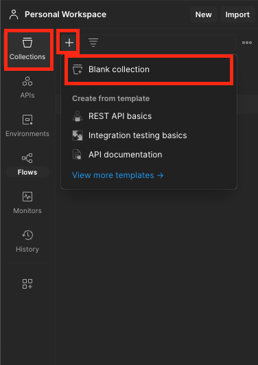
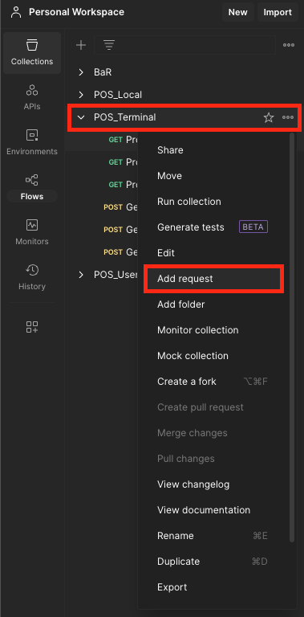
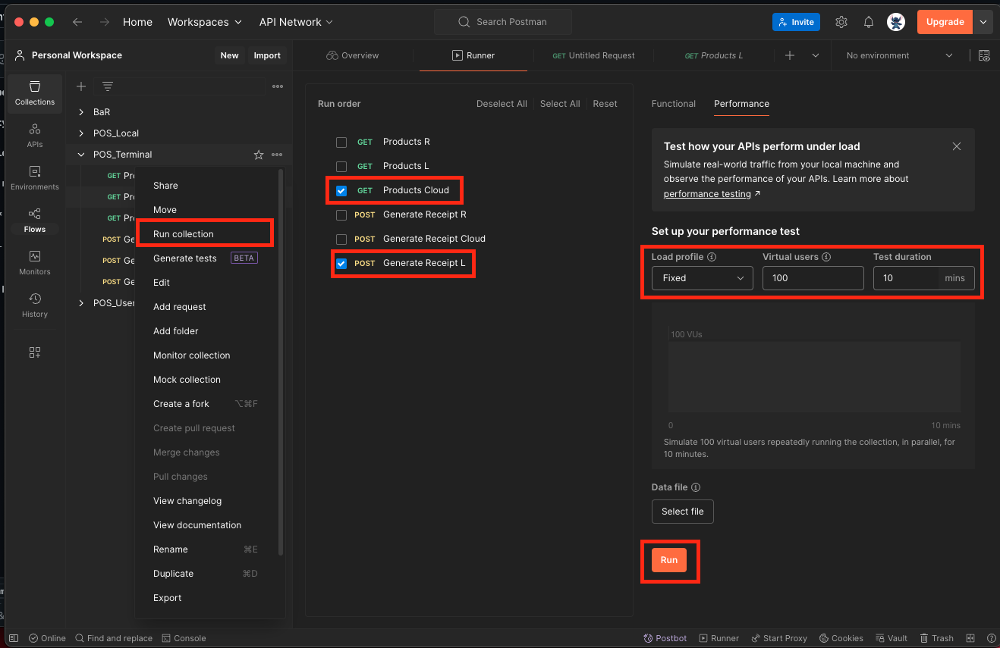
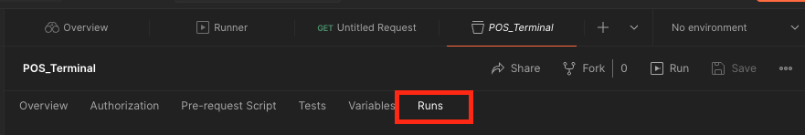
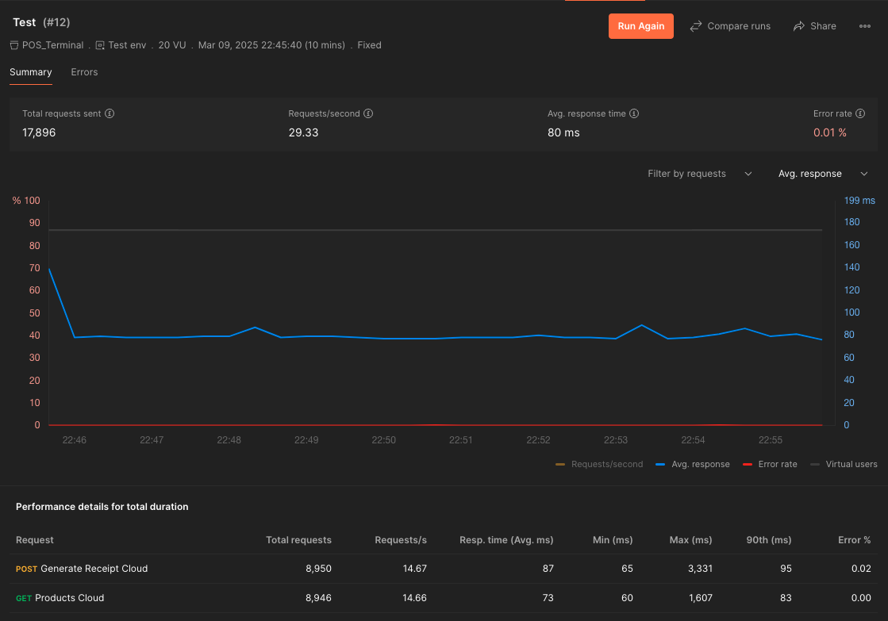

# Príprava experimentov

## Prerekvizity

1. **Nastavenie prostredia**

  Vyžaduje sa nakonfigurované simulované prostredie. Pokyny na nastavenie tohto prostredia sú uvedené v [README.md](README.md). Postupujte podľa uvedených krokov, aby ste inicializovali a spustili všetky potrebné komponenty. (cloudové nasadenie mikroslužieb a POS systému, lokálne nasadenie POS systému, databáza, ...)

2. **Postman**

  Stiahnite si a nainštalujte [Postman](https://www.postman.com/downloads/).

## Nastavenie Postmana

1. **Vytvorenie kolekcie.**
   Pre správnu a korektnú simuláciu sa odporúča vytvoriť v prostredí Postman samostatnú kolekciu.
   
   

3. **Pridanie koncových bodov.**
   Na základe adresy priradenej brány Azure API Gateway je potrebné definovať jednotlivé koncové body. Pri ich nastavovaní je dôležité vybrať typ metódy HTTP (napr. `POST`, `GET`) a pridať požadované hlavičky vrátane autorizačného tokenu. Postup získania tokenu je opísaný v [README.md](README.md).
   
   

5. **Spustenie testov.**
  Po definovaní koncových bodov je možné pristúpiť k spusteniu testov. Na simuláciu scenárov použitých počas výskumu odporúčame vybrať jednu požiadavku `POST` a jednu požiadavku `GET`. V časti „Load profile“ nastavte profil na `Fixed`, zadajte počet virtuálnych používateľov podľa typu testu (napr. 20, 50 alebo 100) a trvanie testu na 10 minút.ódu. Nastaviť "Load profile" na hodnotu "Fixed", počet virtuálnych používateľov na zákalde požadovaného testu (20, 50, 100) a trvanie testovania na hodnotu 10 minút.

   
   
   Po ukončení testov je možné získať výsledky výberom testovanej kolekcie -> `Runs` -> `Performance`.

     
   
   Príklad výsledkov testu a vygenerovaného grafu je znázornený na nasledujúcom obrázku.

   
